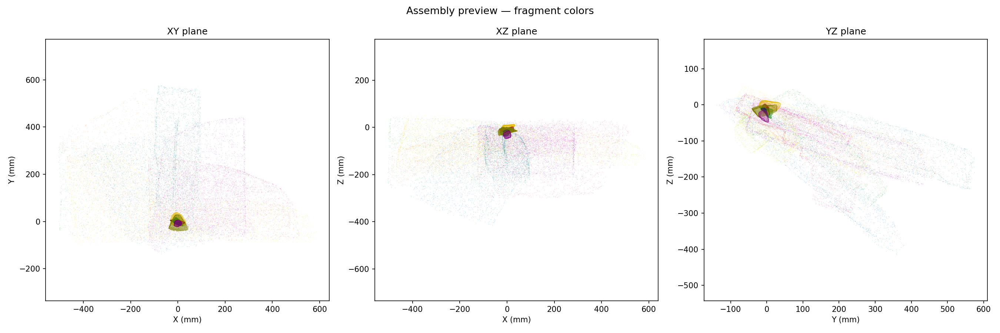
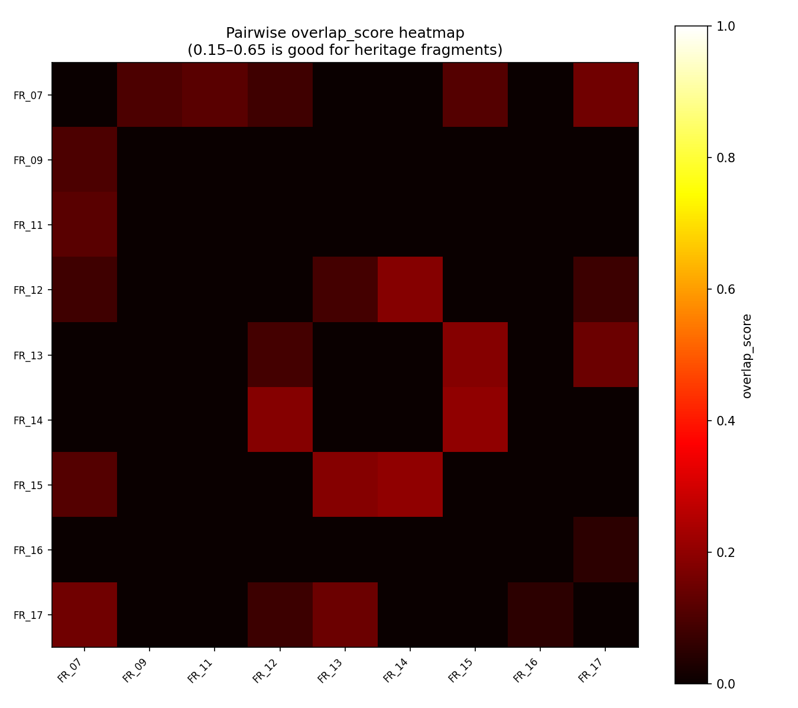
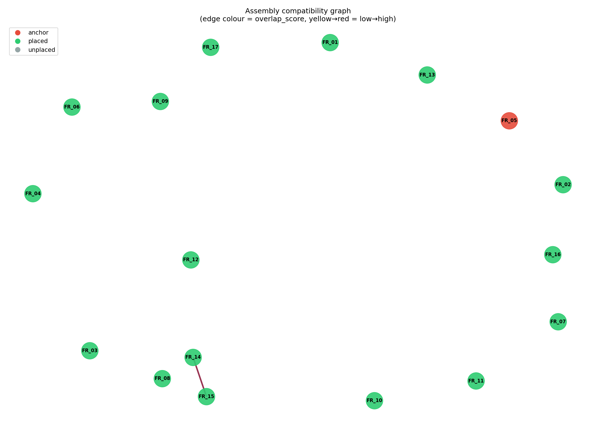
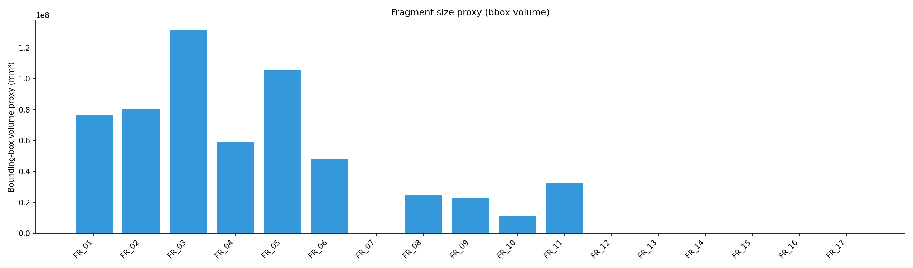
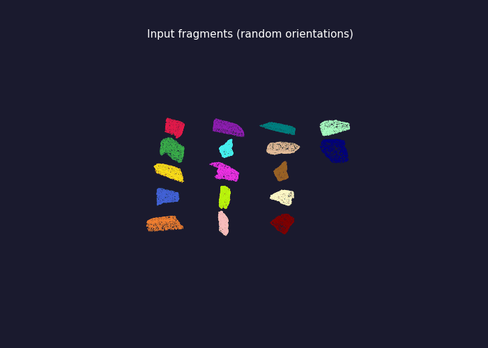
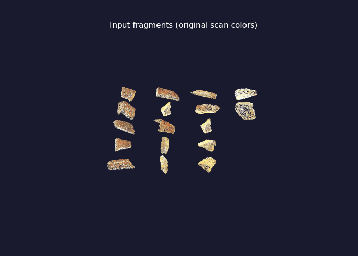
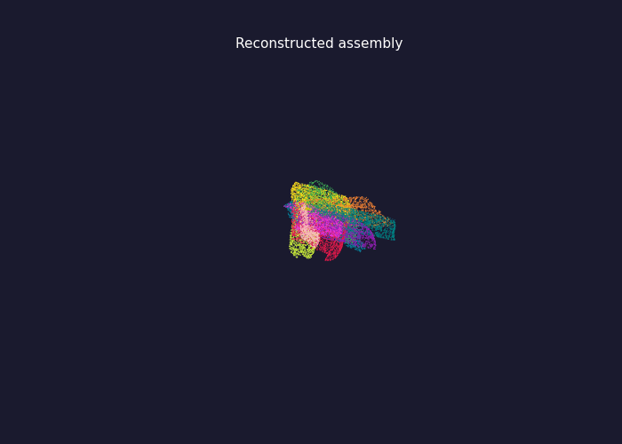
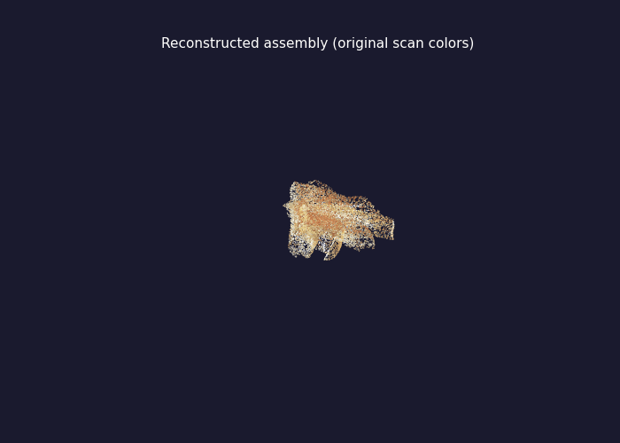
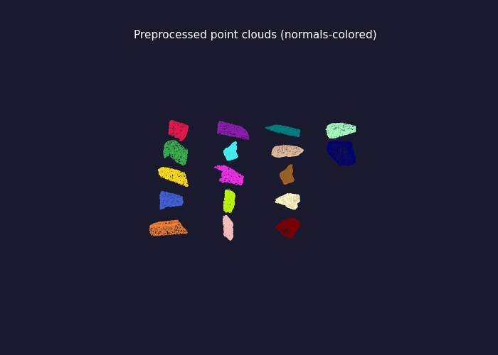

# Healing Stones — 3D Fragment Reconstruction Pipeline

GSoC 2026 Test Submission.

---

## Setup

```bash
source heal/bin/activate
# or: pip install -r requirements.txt
```

## Run

```bash
python run_pipeline.py --config config.yaml
```

Runs end-to-end with no user interaction. Results are saved to `outputs/runs/<timestamp>/`.

Optional flags:

```bash
--input_dir /path/to/fragments   # any folder of .ply / .obj files
--no_cache                       # re-process from scratch
--output_dir /path/to/results
```

## Using Custom Data

To run on your own fragments, either:

**Option A — edit `config.yaml`** (persistent):
```yaml
paths:
  input_3d_dir: path/to/your/fragments   # folder of .ply / .obj files
  processed_dir: path/to/cache           # where preprocessed point clouds are cached
  output_dir: path/to/results
```

**Option B — pass flags at runtime** (one-off):
```bash
python run_pipeline.py --config config.yaml \
  --input_dir /path/to/your/fragments \
  --output_dir /path/to/results
```

Runtime flags override `config.yaml`. Add `--no_cache` to skip any cached preprocessing from a previous run on different data.

---

## Results

Run on 17 Naranjo Stele 43B fragments (~3.3 min on 8 cores).

| Metric | Value | Note |
|---|---|---|
| Fragments placed | 17 / 17 | All assigned a pose, but 16 are identity-transform fallbacks |
| Disconnected components | **16** | Only 1 pairwise edge survived the score threshold |
| Mean ICP fitness | 0.333 | Fraction of points within 3 mm of target surface; 0.15–0.65 is normal for heritage fragments with missing material |
| Mean ICP RMSE | 1.19 mm | Surface distance at the one matched interface — sub-mm would indicate a tight fit |
| Max collision fraction | 0.238 | 23.8% of FR-14's points interpenetrate FR-15; flagged as misplacement |
| Physically plausible | **No** | Any pair exceeding 20% interpenetration fails this check |

**In short:** the pipeline found only 1 reliable pairwise match (FR-14 ↔ FR-15, `overlap_score = 0.201`). The second-best pair scored 0.185 — just below the `min_score_threshold: 0.20` cutoff — leaving 15 fragments as isolated sub-anchors at their original random orientations. The ICP fitness of 0.333 is within the expected range for worn stone fragments, but the assembly itself is not geometrically meaningful. The core issue is that FPFH descriptors cannot distinguish between the many similar flat fracture surfaces across different fragments, making pairwise scores uniformly low. See the proposal for planned improvements.

### Plots

| | |
|---|---|
|  |  |
| Assembly (fragment colors) | Pairwise overlap heatmap |
|  |  |
| Assembly graph | Fragment sizes |

### Visualizations

| Fragment colors | Original scan colors |
|---|---|
|  |  |
| Input fragments (colored by ID) | Input fragments (scan texture) |
|  |  |
| Assembly (colored by ID) | Assembly (scan texture) |


*Preprocessed point clouds (normals-colored)*

---

## Outputs

Each run produces:

```
outputs/runs/<timestamp>/
├── transforms.json          # 4×4 rigid transform per fragment
├── config.yaml              # exact config used (reproducibility)
├── metrics/summary.json     # global + per-pair metrics
├── meshes/                  # colored PLY point clouds
└── plots/                   # assembly previews, heatmap, graph
```
